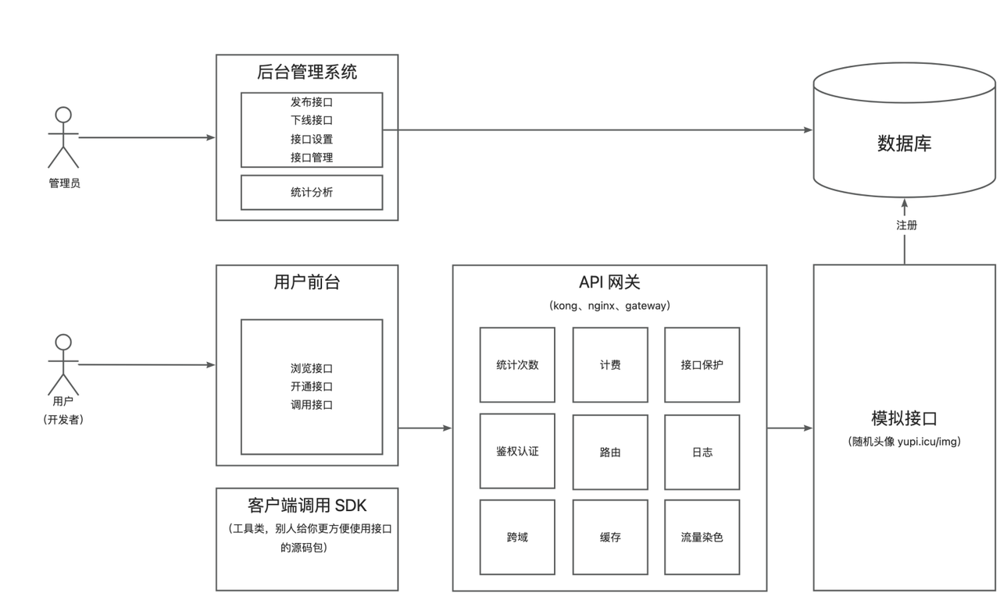

# API开放平台


> **项目地址**
> [前端代码库](https://github.com/codehev/api-frontend) | [后端代码库](https://github.com/codehev/api-backend)

## 项目简介

API开放平台是一个提供API接口供开发者调用的全栈微服务项目，基于Spring Boot后端和React前端架构。平台借鉴现代API开放平台（如百度API开放平台、聚合数据平台、阿里云API网关等）的设计理念，打造了一套完整的接口调用、管理与计费系统。

### 核心功能

- **管理员功能**
  - 接口管理：创建、更新、下线、删除API接口
  - 接口审核：审核开发者提交的接口
  - 用户管理：管理平台用户，设置权限
  - 数据分析：查看平台调用量、用户增长等统计数据
  - 系统监控：监控系统运行状态，查看日志

- **用户功能**
  - 账户管理：注册、登录、个人信息管理
  - 接口浏览：浏览可用接口列表、详情、调用说明
  - 在线调试：在平台上直接测试接口功能
  - 调用管理：查看调用次数、剩余次数
  - 密钥管理：申请、更新访问密钥
  - 计费订阅：购买接口调用次数

- **开发者体验**
  - 客户端SDK：提供Java SDK快速集成API调用
  - 接口文档：自动生成标准化API文档
  - 签名认证：提供安全的接口调用机制
  - 错误码规范：统一的错误码和响应格式

本项目侧重后端设计，包含丰富的微服务架构设计、接口鉴权、网关设计等技术实践。

## 系统架构



### 架构说明

- **网关层**：统一接入层，负责请求转发、鉴权、限流、计费等
- **业务层**：核心业务逻辑处理，包括用户管理、接口管理等
- **接口层**：实际API接口实现，可动态扩展
- **SDK层**：为开发者提供的便捷调用工具
- **公共层**：提供全局通用的工具类和模型

## 项目模块

- `api-server`：平台主服务，提供用户管理、接口管理等功能
  - 用户账户管理
  - 接口信息管理
  - 调用统计与分析
  - 订单与计费系统

- `api-interface`：接口服务，实现各种可调用的API接口
  - 示例接口实现
  - 第三方接口集成
  - 接口测试功能

- `api-consumer`：API调用方，负责调用接口服务
  - 接口调用逻辑
  - 失败重试机制
  - 结果处理

- `api-client-sdk`：提供给开发者的客户端SDK
  - 接口调用封装
  - 请求签名生成
  - 通用工具方法

- `api-common`：公共模块，包含通用工具类和常量
  - 通用工具类
  - 全局常量
  - 统一响应格式

- `api-model`：数据模型，定义实体类和数据传输对象
  - 数据库实体类
  - 传输对象定义
  - 请求/响应模型

## 技术栈

### 前端技术

- React 18
- Ant Design Pro 5.x 脚手架
- Ant Design & Procomponents 组件库
- Umi 4 前端框架
- OpenAPI 前端代码生成
- Echarts 数据可视化
- Axios HTTP客户端
- TypeScript 类型系统
- Mockjs 数据模拟

### 后端技术

- Java Spring Boot 框架
- MySQL 数据库
- MyBatis-Plus ORM框架
- API 签名认证（Http 调用）
- Spring Boot Starter（SDK 开发）
- Dubbo 分布式服务框架
- Nacos 服务注册与发现
- Spring Cloud Gateway 微服务网关
- Swagger + Knife4j 接口文档生成
- Redis 缓存与分布式锁
- Elasticsearch 日志存储与搜索
- RocketMQ 消息队列
- Sentinel 流量控制
- Hutool、Apache Common Utils、Gson 等工具库

## 业务流程

### 接口调用流程

1. 开发者注册并登录平台
2. 浏览可用接口并选择所需接口
3. 申请开通接口调用权限
4. 获取AccessKey和SecretKey
5. 集成SDK或按照调用规则构建请求
6. 发起API调用（经过网关鉴权、计费）
7. 获取接口响应结果

### 接口发布流程

1. 管理员创建新接口信息
2. 配置接口参数、请求方式、响应格式
3. 对接实际接口实现
4. 测试接口功能
5. 发布接口到平台
6. 用户可见并可申请调用

## 快速开始

### 环境要求

- JDK 1.8+
- Maven 3.5+
- MySQL 5.7+
- Redis 6.0+
- Nacos 2.0+
- Node.js 16+
- npm 7+

### 本地开发

#### 1. 克隆前后端代码库
```bash
git clone https://github.com/codehev/api-backend.git
git clone https://github.com/codehev/api-frontend.git
```

#### 2. 初始化数据库
```sql
CREATE DATABASE api_platform;
USE api_platform;
-- 运行项目中的SQL脚本初始化表结构和数据
```

#### 3. 配置Nacos服务
```bash
# 下载并启动Nacos服务
# 导入项目配置到Nacos
```

#### 4. 配置后端服务
```bash
# 修改application.yml中的数据库连接、Redis连接等配置
```

#### 5. 启动后端服务
```bash
cd api-backend
mvn clean install -Dmaven.test.skip=true
mvn spring-boot:run -pl api-server
```

#### 6. 启动前端服务
```bash
cd api-frontend
npm install
npm run dev
```

### 生产环境部署

#### 后端部署
```bash
# 打包
mvn clean package -Dmaven.test.skip=true

# 部署到服务器
java -jar api-server/target/api-server-0.0.1.jar --spring.profiles.active=prod
```

#### 前端部署
```bash
# 构建生产环境代码
npm run build

# 部署到Nginx
cp -r dist/* /usr/share/nginx/html/
```

## API文档

项目集成了Swagger和Knife4j，启动后可访问接口文档：

- 本地文档地址：http://localhost:8080/api/doc.html
- 线上文档地址：https://api.example.com/api/doc.html

## 常见问题

### 1. 如何申请接口调用权限？
注册并登录平台后，在接口详情页点击"申请调用"按钮，按照提示完成申请流程。

### 2. 如何集成SDK？
```xml
<!-- 添加依赖 -->
<dependency>
    <groupId>com.codehev</groupId>
    <artifactId>api-client-sdk</artifactId>
    <version>0.0.1</version>
</dependency>
```

```java
// 初始化客户端
ApiClient client = new ApiClient("your-access-key", "your-secret-key");
// 调用接口
String result = client.invokeInterface("接口名", "请求参数");
```

### 3. 请求签名算法是什么？
平台使用HMAC-SHA256算法对请求参数进行签名，确保请求的安全性和完整性。详细签名规则请参考API文档。

## 参与贡献

1. Fork 本仓库
2. 新建 feature/xxx 分支
3. 提交代码
4. 新建 Pull Request

## 版本规划

- v0.1.0：基础功能实现，包括用户注册、接口调用等核心功能
- v0.2.0：增加接口管理、统计分析功能
- v1.0.0：完善SDK、网关功能，发布第一个正式版
- v2.0.0：支持更多接口类型，优化性能和用户体验

## 许可证

本项目采用 [MIT 许可证](LICENSE) 